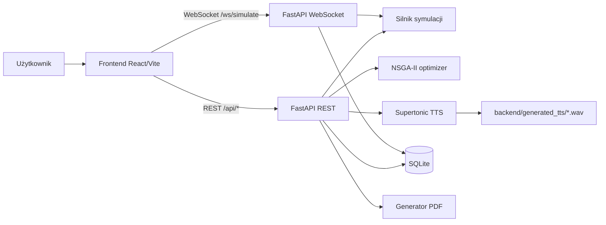
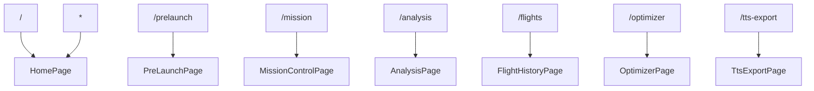
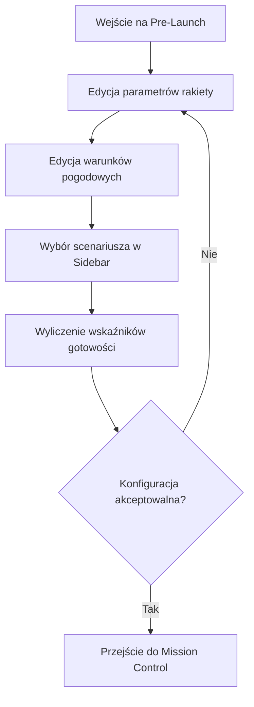
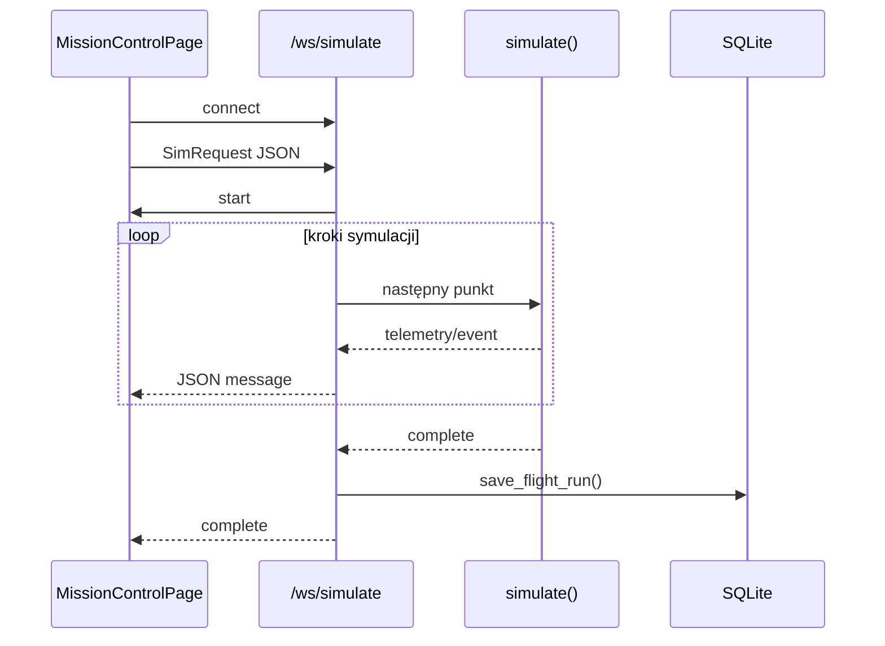
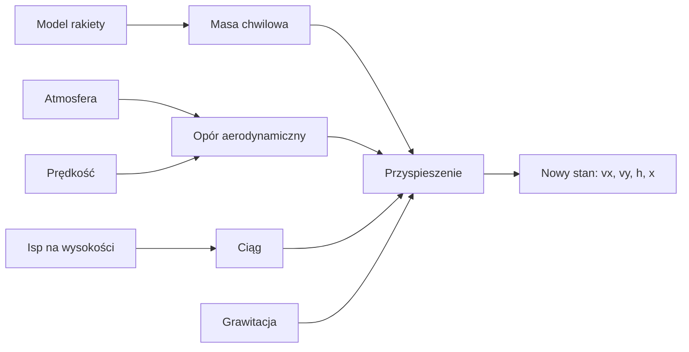
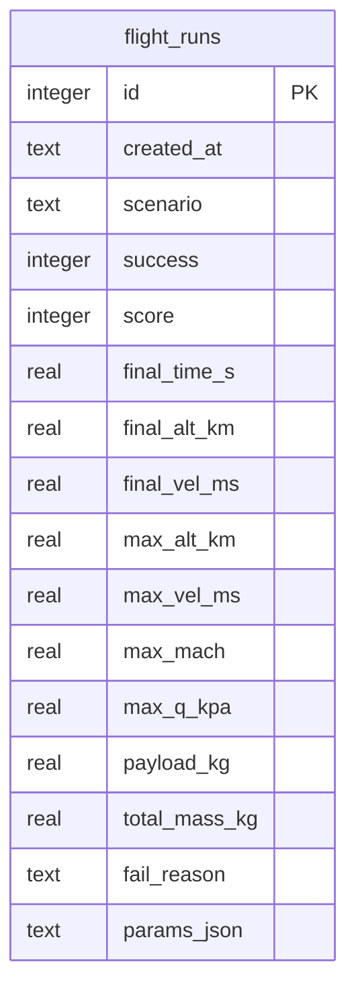
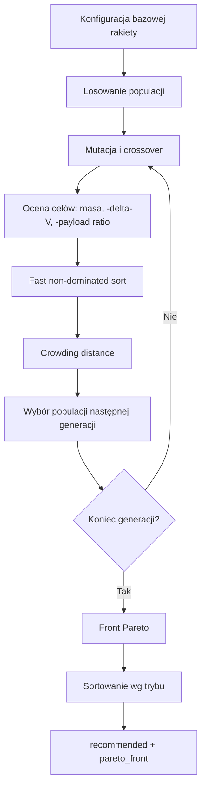
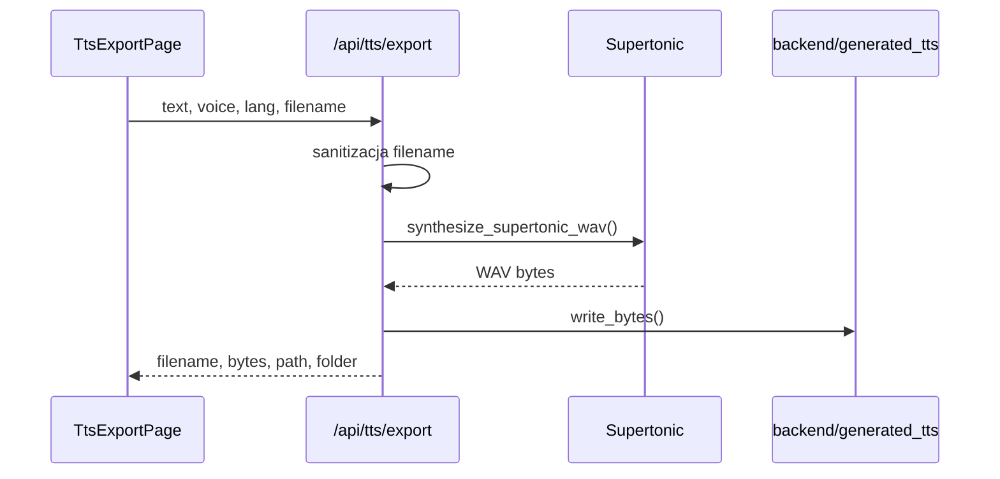
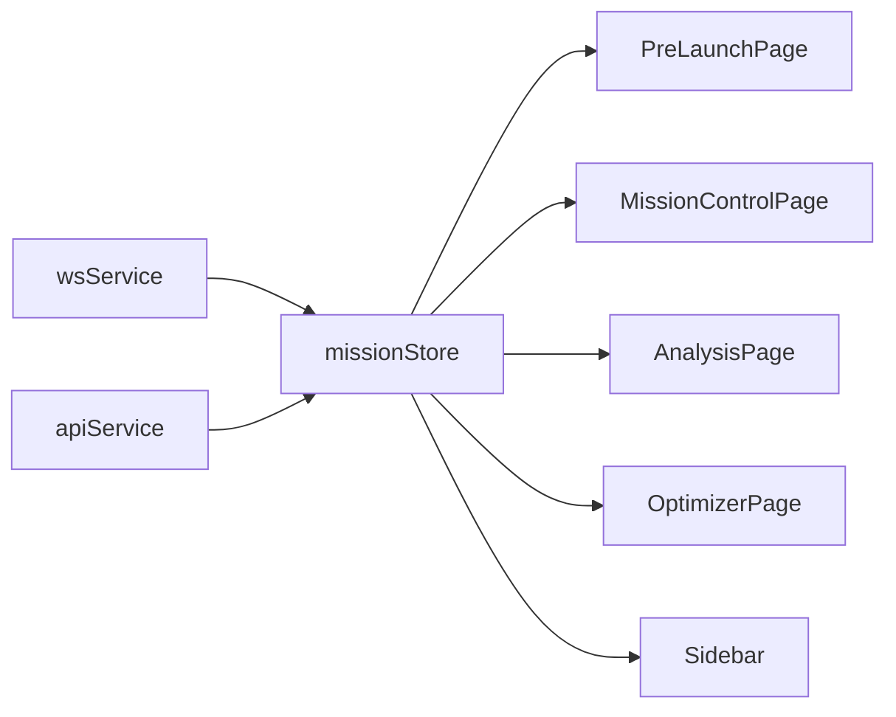

<!-- @file: .\DOKUMENTACJA.pl.md -->
```yaml
created: 2026-05-24T00:00:00Z
updated: 2026-05-24T00:00:00Z
brief: "Pełna dokumentacja aplikacji IGNICULLUS: architektura, moduły, przepływy, API, TTS, optymalizacja i uruchamianie."
```

# IGNICULLUS - dokumentacja techniczna

## 1. Cel systemu

IGNICULLUS jest aplikacją webową do symulowania misji rakiety nośnej. System pozwala skonfigurować pojazd, warunki atmosferyczne i scenariusz misji, uruchomić symulację, obserwować telemetrię na żywo, zapisywać wyniki w bazie danych, generować raporty PDF, eksportować pliki TTS oraz używać optymalizatora AI do poprawy osiągów.

Dokument opisuje aktualny stan repozytorium:

- backend: FastAPI, WebSocket, SQLite, Supertonic TTS, NSGA-II optimizer,
- frontend: React, Vite, Zustand, Recharts,
- komunikację: REST API i WebSocket,
- dane: konfiguracja misji, telemetria, historia lotów, pliki WAV,
- operacje: uruchomienie lokalne, Docker Compose, walidacja i typowe problemy.

## 2. Mapa funkcji użytkownika

| Strona | Cel | Główne funkcje |
|---|---|---|
| Home | Start aplikacji | Wprowadzenie do systemu i nawigacja |
| Pre-Launch | Przygotowanie misji | Parametry rakiety, pogody i gotowości |
| Mission Control | Odpalenie rakiety | WebSocket, telemetria, event log, TTS |
| Analysis | Analiza lotu | Wykresy, dane końcowe, raport PDF |
| Flight Scores | Historia misji | Lista zapisanych lotów z bazy SQLite |
| AI Optimizer | Dobór parametrów | NSGA-II, front Pareto, rekomendacja |
| TTS Export | Generowanie audio | Tekst, głos, język PL/EN, zapis WAV na dysku |

## 3. Struktura repozytorium

```text
Symulator/
├── backend/
│   ├── main.py
│   ├── api/
│   │   ├── routes.py
│   │   └── ws_simulate.py
│   ├── core/
│   │   ├── atmosphere.py
│   │   ├── flight_db.py
│   │   ├── optimizer.py
│   │   ├── rocket_model.py
│   │   ├── scenarios.py
│   │   ├── simulation.py
│   │   └── supertonic_tts.py
│   ├── models/
│   │   └── schemas.py
│   ├── generated_tts/
│   ├── ignicullus.sqlite3
│   └── requirements.txt
├── frontend/
│   ├── src/
│   │   ├── components/
│   │   │   └── Sidebar.tsx
│   │   ├── pages/
│   │   │   ├── AnalysisPage.tsx
│   │   │   ├── FlightHistoryPage.tsx
│   │   │   ├── HomePage.tsx
│   │   │   ├── MissionControlPage.tsx
│   │   │   ├── OptimizerPage.tsx
│   │   │   ├── PreLaunchPage.tsx
│   │   │   └── TtsExportPage.tsx
│   │   ├── services/
│   │   │   ├── apiService.ts
│   │   │   └── wsService.ts
│   │   ├── store/
│   │   │   └── missionStore.ts
│   │   └── types/
│   │       └── index.ts
│   ├── package.json
│   └── vite.config.ts
├── docker-compose.yml
├── package.json
├── README.md
└── DOKUMENTACJA.pl.md
```

## 4. Architektura wysokiego poziomu



### 4.1. Podział odpowiedzialności

| Warstwa | Odpowiedzialność |
|---|---|
| Frontend | UI, routing, stan misji, wykresy, wysyłanie requestów |
| Backend API | Walidacja requestów, REST, PDF, TTS, optymalizacja |
| WebSocket | Strumieniowanie telemetrii misji do frontendowego Mission Control |
| Core simulation | Model rakiety, atmosfera, scenariusze, integracja ruchu |
| SQLite | Historia lotów i wyniki misji |
| Supertonic | Synteza mowy do WAV |

## 5. Uruchamianie lokalne

### 5.1. Wymagania

- Python z obsługą zależności z `backend/requirements.txt`.
- Node.js i npm.
- Opcjonalnie Docker Desktop, jeśli używany jest `docker compose`.
- Dostęp do sieci przy pierwszym uruchomieniu Supertonic, jeśli model musi zostać pobrany.

### 5.2. Uruchomienie przez npm

Z katalogu repozytorium:

```powershell
npm run dev
```

Skrypt root uruchamia frontend przez `frontend/package.json`. Aktualny frontend ma skrypt `dev`, który odpala backend i frontend razem przez `frontend/scripts/dev-all.cjs`.

Adresy:

- frontend: `http://localhost:5173`
- backend: `http://localhost:8000`
- Swagger/OpenAPI: `http://localhost:8000/docs`

### 5.3. Uruchomienie ręczne

Backend:

```powershell
Set-Location .\backend
pip install -r requirements.txt
python -m uvicorn main:app --reload --host 0.0.0.0 --port 8000
```

Frontend:

```powershell
Set-Location .\frontend
npm install
npm run dev:frontend
```

### 5.4. Docker Compose

```powershell
docker compose up --build
```

Kontenery:

- `backend`: FastAPI na porcie `8000`,
- `frontend`: frontend na porcie `5173`,
- backend montuje lokalny katalog `./backend:/app`, więc baza SQLite i wygenerowane pliki pozostają w repozytorium.

## 6. Routing frontendowy

Routing jest zdefiniowany w `frontend/src/App.tsx`.



Sidebar odpowiada za główną nawigację, wybór scenariusza oraz ustawienia TTS dla komentarza misji.

## 7. Model danych i konfiguracja misji

Schematy requestów backendu są w `backend/models/schemas.py`.

### 7.1. Rakieta

`RocketConfig` zawiera:

- `stage1`: masa sucha, masa paliwa, ciąg, Isp próżniowy, Isp na poziomie morza, czas pracy,
- `stage2`: analogiczne parametry drugiego stopnia,
- `payload_kg`: masa ładunku,
- `fairing_kg`: masa owiewki,
- `diameter_m`: średnica rakiety,
- `cd_base`: bazowy współczynnik oporu.

### 7.2. Atmosfera

`AtmosphereConfig` zawiera:

- `wind_speed_ms`,
- `temperature_delta_k`,
- `humidity_pct`,
- `pressure_hpa`.

Te wartości wpływają na gęstość powietrza, opór aerodynamiczny i warunki startowe.

### 7.3. Symulacja

`SimConfig` zawiera:

- `dt`: krok symulacji,
- `max_time`: maksymalny czas lotu,
- `leo_alt_km`: docelowa wysokość orbity,
- `leo_vel_ms`: docelowa prędkość orbitalna.

## 8. Przepływ Pre-Launch

Pre-Launch służy do przygotowania rakiety przed misją.



Kontrole gotowości obejmują między innymi:

- łączną delta-V,
- delta-V stopnia pierwszego i drugiego,
- TWR pierwszego stopnia,
- Isp,
- wiatr,
- ciśnienie,
- odchylenie temperatury,
- efektywną gęstość powietrza.

## 9. Scenariusze misji

Scenariusze są w `backend/core/scenarios.py`.

| ID | Nazwa | Efekt |
|---|---|---|
| `nominal` | Nominal Mission | Standardowa próba osiągnięcia LEO |
| `engine_failure_s1` | S1 Engine Failure | Awaria silnika pierwszego stopnia około T+30s |
| `overloaded_payload` | Overloaded Payload | Ładunek 2x nominalny, deficyt delta-V |
| `atmospheric_anomaly` | Atmospheric Anomaly | Zwiększona gęstość/opór atmosfery |
| `ai_optimized` | AI Optimized | Lepsze Isp i mniejsza masa strukturalna |

Scenariusz jest przekazywany do symulacji jako `scenario` w `SimRequest`.

## 10. Mission Control i telemetria na żywo

Mission Control korzysta z WebSocket `ws://<host>:8000/ws/simulate`.



### 10.1. Typy wiadomości WebSocket

| Typ | Znaczenie |
|---|---|
| `start` | Początek misji |
| `telemetry` | Punkt telemetrii: wysokość, prędkość, Mach, Q, masa, paliwo |
| `event` | Zdarzenie misji, np. MECO, MAX-Q, STAGE SEP |
| `complete` | Koniec misji i status orbity |
| `error` | Błąd backendu |

### 10.2. Dane telemetrii

Punkt telemetrii zawiera między innymi:

- `t`: czas misji,
- `alt`: wysokość w km,
- `vel`: prędkość w m/s,
- `mach`,
- `accel_g`,
- `q_kpa`,
- `downrange`,
- `thrust`,
- `drag`,
- `mass`,
- `s1_prop`, `s2_prop`,
- `stage`,
- `cd`,
- `stab`.

## 11. Silnik symulacji

Silnik symulacji znajduje się w `backend/core/simulation.py`.

### 11.1. Co liczy symulacja

Symulacja uwzględnia:

- masę rakiety i spalanie paliwa,
- przejście między stopniem pierwszym i drugim,
- zmianę kąta lotu przez gravity turn,
- grawitację zależną od wysokości,
- gęstość powietrza,
- prędkość dźwięku,
- współczynnik oporu zależny od Macha,
- opór aerodynamiczny,
- wpływ wiatru,
- zdarzenia misji,
- kryterium osiągnięcia orbity.

### 11.2. Uproszczony model sił



W kodzie integracja jest prosta i krokowa. Komentarz w pliku określa ją jako Euler przy domyślnym `dt=0.1s`.

## 12. Zapis historii lotów

Historia lotów jest obsługiwana przez `backend/core/flight_db.py`.

Baza:

```text
backend/ignicullus.sqlite3
```

Tabela:

```text
flight_runs
```

Zapisywane są:

- czas utworzenia,
- scenariusz,
- sukces/porażka,
- score,
- finalna wysokość i prędkość,
- maksymalna wysokość, prędkość, Mach i Q,
- payload,
- masa całkowita,
- powód porażki,
- JSON z parametrami misji.



## 13. Raport PDF

Endpoint raportu PDF znajduje się w `backend/api/routes.py` jako:

```text
POST /api/report/pdf
```

Raport jest generowany z requestu symulacji. Backend uruchamia symulację synchronicznie, zbiera telemetry i eventy, wylicza wartości maksymalne, a następnie tworzy prosty plik PDF bez zewnętrznej biblioteki PDF.

Frontend wywołuje endpoint przez `generatePdfReport()` w `frontend/src/services/apiService.ts`.

## 14. AI Optimizer - NSGA-II

Optymalizator znajduje się w `backend/core/optimizer.py`.

### 14.1. Cel

Optimizer szuka konfiguracji rakiety, która jest dobrym kompromisem między:

- niską masą całkowitą,
- wysoką delta-V,
- wysokim stosunkiem payload/masa.

Wynik nie jest jednym punktem, tylko frontem Pareto. Front Pareto oznacza zbiór rozwiązań, których nie da się poprawić w jednym celu bez pogorszenia innego celu.

### 14.2. Genom

Genom zawiera pięć współczynników:

```text
[s1_prop_f, s2_prop_f, s1_isp_f, s2_isp_f, fairing_f]
```

Zakresy:

| Parametr | Zakres |
|---|---|
| `s1_prop_f` | 0.80 - 1.15 |
| `s2_prop_f` | 0.80 - 1.15 |
| `s1_isp_f` | 0.96 - 1.06 |
| `s2_isp_f` | 0.96 - 1.07 |
| `fairing_f` | 0.60 - 1.00 |

### 14.3. Cele

Wewnętrznie wszystkie cele są minimalizowane:

```text
f1 = total_mass
f2 = -delta_v
f3 = -payload_ratio
```

Minimalizacja `-delta_v` oznacza maksymalizację delta-V. Minimalizacja `-payload_ratio` oznacza maksymalizację stosunku payload do masy.

### 14.4. Tryby

Frontend wysyła `mode` do endpointu `/api/optimize`.

| Tryb | Priorytet |
|---|---|
| `balanced` | Równowaga masy, delta-V i payload ratio |
| `fuel_efficient` | Niższa masa startowa |
| `max_altitude` | Wyższa delta-V jako proxy wysokości |
| `max_velocity` | Maksymalizacja delta-V |
| `max_payload` | Maksymalizacja payload ratio |

### 14.5. Przepływ optymalizacji



### 14.6. Zastosowanie wyniku

Na stronie `AI Optimizer` użytkownik może zaakceptować rekomendację albo wybrany punkt z tabeli Pareto. Frontend zapisuje wartości do `missionStore` i przechodzi na `/mission`, gdzie można od razu odpalić rakietę z nowymi parametrami.

## 15. TTS w misji

TTS misji jest realizowany przez backendowy Supertonic, a frontend odtwarza zwrócony plik audio.

### 15.1. Endpointy

```text
POST /api/tts/supertonic
GET  /api/tts/supertonic
```

Frontend w `wsService.ts` próbuje kolejno:

1. `POST /api/tts/supertonic`,
2. `GET /api/tts/supertonic?...`,
3. `GET http(s)://<aktualny-host>:8000/api/tts/supertonic?...`.

Takie podejście zabezpiecza aplikację przed błędami proxy lub innym originem w trybie developerskim.

### 15.2. Głos domyślny

Domyślny głos:

```text
F4
```

Backend normalizuje nieznany głos do `F4`.

### 15.3. Cache

Backend ma cache syntezy dla powtarzalnych tekstów. Dzięki temu standardowe komunikaty misji, po pierwszej generacji, mogą być zwracane szybciej.

### 15.4. Warmup

Warmup Supertonic jest opcjonalny i domyślnie wyłączony.

Włączenie:

```powershell
$env:SUPERTONIC_WARMUP = "1"
python -m uvicorn main:app --reload --host 0.0.0.0 --port 8000
```

Powód: pierwsze uruchomienie Supertonic może pobierać model. Automatyczny warmup przy starcie aplikacji mógłby blokować lub mylić użytkownika komunikatem pobierania zasobu.

## 16. TTS Export - zapis WAV na dysku

Strona:

```text
/tts-export
```

Endpoint:

```text
POST /api/tts/export
```

Użytkownik podaje:

- tekst,
- głos,
- język `EN` albo `PL`,
- nazwę pliku.

Backend:

1. sanitizuje nazwę pliku,
2. ogranicza tekst do 5000 znaków,
3. generuje WAV przez Supertonic,
4. zapisuje plik w:

```text
backend/generated_tts/
```

Folder jest dodany do `.gitignore`, ponieważ zawiera artefakty lokalne.



## 17. REST API

Główne endpointy:

| Metoda | Endpoint | Cel |
|---|---|---|
| `GET` | `/api/health` | Status backendu |
| `GET` | `/api/scenarios` | Lista scenariuszy |
| `POST` | `/api/simulate/sync` | Synchroniczna symulacja |
| `POST` | `/api/optimize` | NSGA-II optimizer |
| `GET` | `/api/flights` | Historia lotów |
| `DELETE` | `/api/flights/{run_id}` | Usunięcie lotu |
| `POST` | `/api/tts/supertonic` | Synteza TTS do odpowiedzi WAV |
| `GET` | `/api/tts/supertonic` | Fallback TTS przez query string |
| `POST` | `/api/tts/export` | Zapis WAV do `backend/generated_tts` |
| `POST` | `/api/report/pdf` | Raport PDF |

WebSocket:

| Endpoint | Cel |
|---|---|
| `/ws/simulate` | Start misji i streaming telemetrii |

## 18. Stan frontendowy

Stan misji jest w `frontend/src/store/missionStore.ts` i jest oparty o Zustand.

Przechowywane są między innymi:

- konfiguracja rakiety,
- atmosfera,
- konfiguracja symulacji,
- scenariusz,
- telemetry,
- eventy,
- status misji,
- wynik orbity,
- ustawienia TTS,
- prędkość animacji,
- stan pauzy,
- referencja WebSocket.



## 19. Walidacja i komendy developerskie

### 19.1. Frontend build

```powershell
Set-Location .\frontend
pnpm build
```

albo jeśli używany jest npm:

```powershell
Set-Location .\frontend
npm run build
```

### 19.2. Backend syntax check

```powershell
python -m py_compile .\backend\core\optimizer.py .\backend\models\schemas.py .\backend\api\routes.py .\backend\main.py
```

### 19.3. Szybki test optymalizatora

```powershell
Set-Location .\backend
python -c "from core.optimizer import run_ga; from core.rocket_model import RocketModel; r=RocketModel(800,18000,320000,310,272,150,120,4200,42000,340,380,30,60,1.2,0.35); out=run_ga(r, 2, 8, 'balanced'); print(out['mode'], len(out['pareto_front']), bool(out['recommended']), len(out['history_dv']))"
```

Oczekiwany kształt wyniku:

```text
balanced <liczba_rozwiazan> True 2
```

## 20. Ograniczenia i konsekwencje operacyjne

### 20.1. Symulacja

- Model jest uproszczony i służy do interaktywnej symulacji, nie do certyfikowanej analizy trajektorii.
- Integracja jest krokowa i zależy od `dt`.
- Część zdarzeń misji jest oparta o progi i uproszczone warunki.

### 20.2. SQLite

- Baza jest lokalnym plikiem `backend/ignicullus.sqlite3`.
- Przy uruchamianiu przez Docker z volume dane pozostają lokalnie w katalogu backendu.
- Brak migratora schematu; `init_db()` tworzy tabelę, jeśli jej nie ma.

### 20.3. TTS

- Pierwsze użycie Supertonic może pobierać model.
- Eksport WAV zapisuje pliki lokalnie w repozytorium.
- Nazwa pliku jest sanitizowana i zawsze kończy się `.wav`.
- Folder `backend/generated_tts` nie powinien być commitowany.

### 20.4. Frontend

- Build Vite zgłasza ostrzeżenie o dużym chunku. To warning, nie błąd.
- WebSocket misji używa backendu na porcie `8000`.

## 21. Typowe problemy

### 21.1. `NetworkError when attempting to fetch resource`

Najczęstsze przyczyny:

- backend nie działa na `localhost:8000`,
- proxy Vite nie może połączyć się z backendem,
- przeglądarka działa na innym hoście, a backend nie jest dostępny pod tym samym hostem na porcie `8000`,
- Supertonic długo inicjalizuje model i request jest przerywany.

Sprawdzenie:

```powershell
Invoke-WebRequest http://localhost:8000/api/health
```

### 21.2. TTS długo generuje pierwszy plik

Pierwsze wywołanie może pobrać model Supertonic i załadować głos. Kolejne wywołania są szybsze dzięki cache.

### 21.3. Brak pliku WAV po eksporcie

Sprawdź:

- czy backend działa,
- czy request `/api/tts/export` zwraca sukces,
- czy folder `backend/generated_tts` istnieje,
- czy proces backendu ma prawo zapisu do katalogu repozytorium.

### 21.4. Mission Control nie pokazuje telemetrii

Sprawdź:

- czy backend działa na porcie `8000`,
- czy WebSocket `/ws/simulate` jest dostępny,
- czy frontend wysyła poprawny `SimRequest`,
- czy scenariusz istnieje w `backend/core/scenarios.py`.

## 22. Aktualny kierunek rozwoju

Te punkty nie są wymagane do działania obecnej aplikacji, ale są naturalnymi kolejnymi krokami:

- wydzielenie kodu TTS z `main.py` i `routes.py`, aby uniknąć duplikacji endpointu,
- endpoint statusu TTS/modelu,
- prawdziwy streaming audio, jeśli Supertonic udostępni strumieniowanie chunków,
- migracje bazy danych zamiast samego `CREATE TABLE IF NOT EXISTS`,
- code splitting frontendu, aby usunąć warning dużego chunka,
- testy jednostkowe dla optimizer, `flight_db` i sanitizacji nazw plików.

## 23. Najważniejsze pliki

| Plik | Rola |
|---|---|
| `backend/main.py` | Start FastAPI, CORS, router, WebSocket, opcjonalny warmup TTS |
| `backend/api/routes.py` | REST API, TTS, PDF, optimizer, flight history |
| `backend/api/ws_simulate.py` | Obsługa WebSocket symulacji |
| `backend/core/simulation.py` | Główna pętla symulacji |
| `backend/core/rocket_model.py` | Model rakiety i aerodynamika zależna od Macha |
| `backend/core/optimizer.py` | NSGA-II multi-objective optimizer |
| `backend/core/supertonic_tts.py` | Supertonic TTS, cache, warmup |
| `backend/core/flight_db.py` | SQLite i historia lotów |
| `frontend/src/store/missionStore.ts` | Globalny stan misji |
| `frontend/src/services/wsService.ts` | WebSocket, TTS odtwarzany w przeglądarce |
| `frontend/src/services/apiService.ts` | Klient REST API |
| `frontend/src/pages/PreLaunchPage.tsx` | Konfiguracja misji |
| `frontend/src/pages/MissionControlPage.tsx` | Telemetria i odpalenie rakiety |
| `frontend/src/pages/OptimizerPage.tsx` | AI optimizer UI |
| `frontend/src/pages/TtsExportPage.tsx` | Eksport tekstu do WAV |

